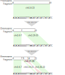

# Hi-C reassembler

Toolkit for the reassembly of structural variation (SV) in genomes using Hi-C contacts. The goal of this project is to automatically fix large inconsistencies between the reference genome and sample of interest, for example in the case of cancer cell lines or misassembled genomes.

This project is separated into 3 submodules:
* scramble: Simulating structural variants and constructing the associated Hi-C map, this is mainly used to generate training data.
* detect: Find the location of candidate breakpoints using Hi-C contact and refine the location using read alignments.
* reassemble: Edit the genome based on detected breakpoints to recover the sequence that matches Hi-C contacts.

## Setup

To work on this project, `git clone` the repository, `cd` into it and install it with:

```bash
pip install -e .
```

## Data structures used

Throughout the different submodules, the genome is represented as a collection of chromosomes. Each chromosome contains Fragments, which point to a reference sequence. Introducing SVs



## Training

This program works with machine learning methods, it needs to have in input training set for each detector:

* Matrixdetector, which will detect SVs on Hi-C maps,
* BAMdetector, which detect the exact position on bam files of the structural variations,
* RepeatsFinder and BadMappedFinder, which respectively find repeats or positions where there are a lot of reads which are not correctly mapped. These two detector are used by BAMdetector.

When all training sets are in the folder "data/training", you can train the models:

```train
make train
```

## Detection & reassembly

After the training has been done, the program can detect SVs on Hi-C maps and reassemble the matrix. The program needs to have a Hi-C matrix (format npy), the sequence associated (format fasta), the name of the chromosome linked to the matrix and the binsize which has been used to generate the matrix. To reassemble, you must run the script with the good arguments:

```reassembler
binsize = 10000
hic_file = "data/testing/scrambled.npy"
seq_file = "data/testing/seq.fa"
bam_file = "data/testing/scrambled.for.bam"
chrom_name = "Sc_chr04"

python ./scripts/reassemble.py -b binsize hic_file seq_file bam_file chrom_name
```

It is also possible to just detect the structural variations, without reassembly:

```detection
binsize = 10000
hic_file = "data/testing/scrambled.npy"
seq_file = "data/testing/seq.fa"
bam_file = "data/testing/scrambled.for.bam"
chrom_name = "Sc_chr04"

python ./scripts/detect.py -b binsize hic_file seq_file bam_file chrom_name
```

Before the reassembly, it can be important to clean the ouput directory with the script associated:

```clean
python ./scripts/clean.py
```

## Output

The programs will generate an output directory containing different files. Firstly, it will generate in a folder four files linked to the detection:

* "DEL_detected.npy", a npy file with the coordinates on the BAM files of the deletions detected, 
* "INS_detected.npy", a npy file with the coordinates on the BAM files of the insertions detected, 
* "INV_detected.npy", a npy file with the coordinates on the BAM files of the inversions detected,
* "TRA_detected.npy", a npy file with the coordinates on the BAM files of the translocations detected.  

If you proceed to the reassembly, the program will also generate 3 files in a different folder linked to the reassembly of the Hi-C map:

* "mat_reassembled.npy", a file with the Hi-C matrix which has been reassembled,
* "seq_reassembled.fa", a fasta file with the sequence which has been reassembled,
* "difference.png", a png file with a picture where we can see the Hi-C map before and after the reassembly (in order to compare).